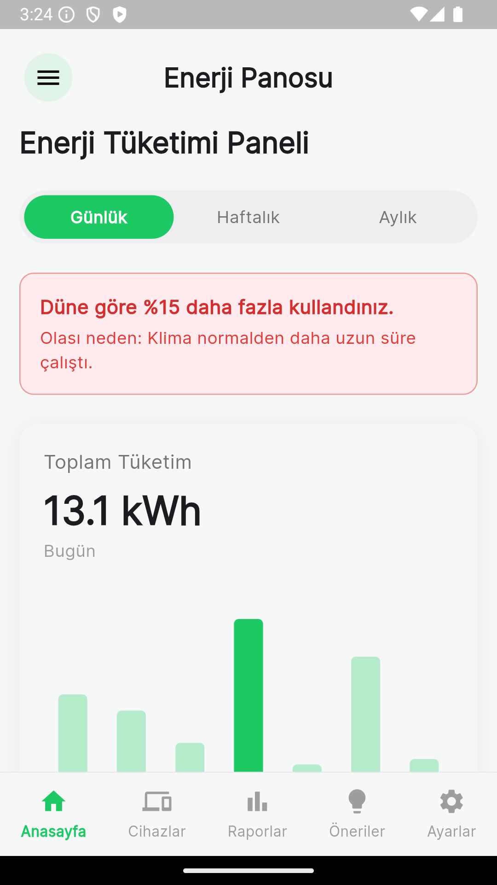
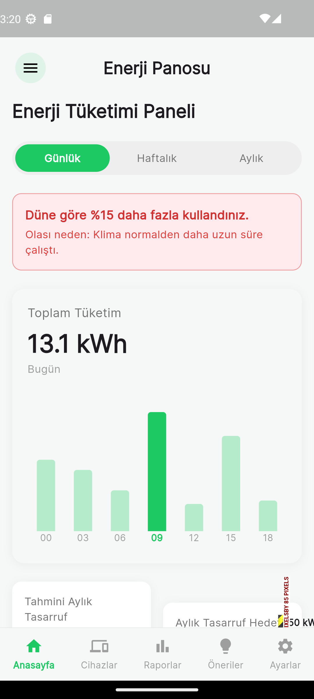
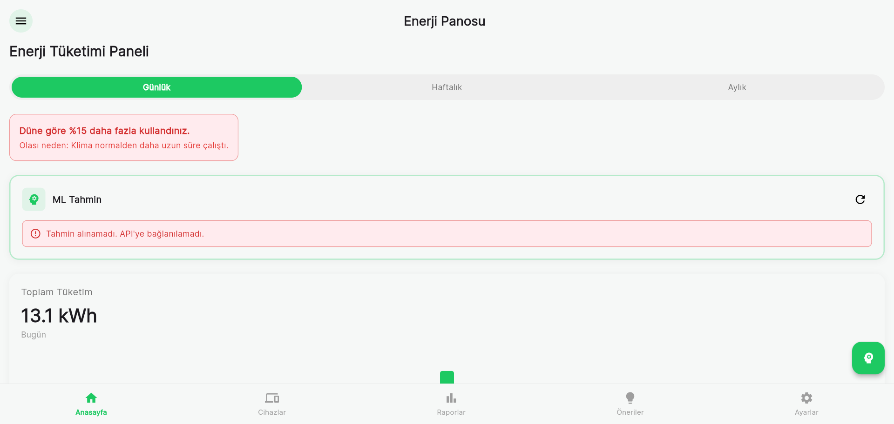

# 🏠 Akıllı Evlerde Enerji Tasarrufu

[](https://flutter.dev)
[](https://dart.dev)
[](https://www.python.org)
[](#-model-card)
[](#-model-card)
[](#-python-backend-ml-api)
[](#-platform-desteği)

> **TR (Slogan):** Enerji tüketimini görünür kıl, tahmin et, optimize et — **daha düşük fatura, daha verimli ev**.
>
> **TR:** Akıllı ev enerji verilerini izleyip analiz ederek **tasarruf fırsatları** sunan; ayrıca **ML tabanlı tüketim tahmini** yapabilen Flutter uygulaması.
>
> **EN:** A Flutter app that monitors and analyzes smart-home energy data to surface **saving opportunities**, with optional **ML-based consumption forecasting**.

---

## ✨ Öne Çıkan Yetkinlikler (İK için)
Bu repo, tek bir projede aşağıdaki yetkinlikleri gösterir:
- **Mobil uygulama geliştirme:** Flutter / Dart, çoklu platform
- **Veri & analitik:** grafikler, trend/karşılaştırma, (opsiyonel) anomali yaklaşımı
- **Backend entegrasyonu:** REST API üzerinden ML tahmin servisi
- **Makine öğrenmesi:** Random Forest Regressor, feature engineering, model meta endpoint’i
- **Güvenlik farkındalığı:** secret/env yaklaşımı, yapılandırma örnekleri, güvenlik dokümanı

---

## Neden Bu Proje? (Herkes İçin)
- **Gözle görülür içgörü:** Tüketimi anlık izleyin, trendleri görün, gereksiz harcamayı yakalayın.
- **Akıllı öneriler:** Tasarruf önerileri ile kullanım alışkanlıklarını iyileştirin.
- **Tahminleme (ML):** Geleceğe yönelik tüketim tahminiyle proaktif aksiyon alın.

## Hızlı Tanıtım (10 saniyede)
**Bu projede:** Mobil uygulama (Flutter) + Backend API (Python/FastAPI) + ML model (Random Forest) + veri akışı + temel güvenlik pratikleri (secret/env) birlikte kullanıldı.

---

## 📸 Uygulama Görselleri
Aşağıdaki ekranlar, uygulamanın “bitmiş ürün” hissini ve ana akışı gösterir.

| Dashboard | Raporlar | Öneriler |
|---|---|---|
|  |  |  |

> Not: Repoda `flutter_01.png`–`flutter_13.png` arasında daha fazla ekran görüntüsü bulunur.

### Tüm ekranlar (1–13)
<details>

## ⏱️ 1 Dakikalık Demo Akışı

Bu akış, projeyi teknik olmayan birine bile 60 saniyede anlatmak için tasarlandı.

1. **Login / Register**: Uygulamaya giriş yap.
2. **Dashboard**: Anlık tüketimi ve günlük/haftalık filtreyi değiştirerek trendleri göster.
3. **ML Tahmin**: Tahmin kartını/aksiyonunu tetikle, tahmin sonucunu ve mevcut değerle farkını göster.
4. **Reports**: Haftalık/aylık raporlara geç, grafik ve karşılaştırmaları göster.
5. **Suggestions**: Bir tasarruf önerisini aç, "uygula" akışını göster ve potansiyel tasarrufu kWh/TL olarak yorumla.

> **Mülakat Notu:** Bu demo; **mobil UI**, **veri görselleştirme**, **ML servis entegrasyonu** ve **ürün düşüncesi** (tasarruf çıktısı) yetkinliklerini aynı anda gösterir.


<summary>Görselleri genişlet</summary>

| 01 | 02 | 03 |
|---|---|---|
|  |  |  |

| 04 | 05 | 06 |
|---|---|---|
|  |  |  |

| 07 | 08 | 09 |
|---|---|---|
|  |  |  |

| 10 | 11 | 12 |
|---|---|---|
|  |  |  |

| 13 |
|---|
|  |

</details>

---

## ✨ Özellikler
### Kullanıcı
- 📊 **Gerçek Zamanlı Enerji İzleme** – Anlık tüketim takibi
- 📈 **Detaylı Raporlar** – Günlük/haftalık/aylık grafikler
- 💰 **Tasarruf Önerileri** – Kişiselleştirilebilir öneriler
- 🤖 **ML Tahmin Sistemi** – Gelecek tüketim tahmini (backend API ile)
- 🌤️ **Hava Durumu Entegrasyonu** – Koşullara göre optimizasyon (opsiyonel)
- 📅 **Cihaz Zamanlama** – Otomatik açma/kapama programları

### Admin
- 👥 **Kullanıcı Yönetimi** – Kullanıcıları görüntüleme ve yönetme
- 📊 **Sistem Analizi** – Genel sistem istatistikleri
- ⚙️ **Sistem Ayarları** – Platform yapılandırması

---

## 🧩 Mimari (Basit Anlatım)
1. **Flutter uygulaması** kullanıcı arayüzünü ve akışı sağlar.
2. **Python API** (ML servisi) tahmin isteklerini alır ve yanıtlar.
3. **Random Forest model** sensör/özellik vektöründen tüketim tahmini üretir.

> Teknik detaylar için: **[ML_INTEGRATION.md](ML_INTEGRATION.md)**

---

## 🪪 Model Card
Bu bölüm, “model var mı / ne kadar iyi / neyle eğitilmiş” sorularını tek yerde yanıtlar.

- **Model tipi:** Random Forest Regressor
- **Problem:** Enerji tüketimi tahmini (regresyon)
- **Test performansı:** **R² = 0.96** *(test seti)*
- **Feature sayısı:** 20
- **Eğitim verisi:** `SmartHome_Energy_Weather_Combined.csv` (**8763 satır**)

### Feature Grupları (Özet)
- **Zaman:** `Hour`, `DayOfWeek`, `Month`, `IsWeekend`, `Season`, `TimeOfDay`
- **Geçmiş tüketim:** `Prev_Hour_Power`, `Prev_2Hour_Power`, `Prev_Day_Power`, `Rolling_Mean_24h`, `Rolling_Std_24h`
- **Çevresel:** `Temperature`, `Humidity`, `Temp_Category`, `Prev_Hour_Temp`
- **Elektrik/sayaç:** `Sub_metering_1`, `Sub_metering_2`, `Sub_metering_3`, `Voltage`, `Global_intensity`

> Kaynak: **[BİTİRME_PROJESİ_DOKÜMANI.md](BİTİRME_PROJESİ_DOKÜMANI.md)**

---

## 🤖 Python Backend (ML API)
### API Endpoint’leri
- `GET /meta` – Model meta bilgileri
- `POST /predict` – Tek tahmin
- `POST /predict_many` – Çoklu tahmin

---

## 🔐 Güvenlik (Güven Veren Kısım)
Bu repo eğitim amaçlı olsa da temel güvenlik pratikleri düşünülmüştür:
- API key / credential gibi hassas bilgiler **repoya yazılmamalı** (örn. `.env`, Firebase config).
- Örnek yapılandırma için `.env.example` kullanılır.
- Production’da kimlik doğrulama, rate-limit ve RBAC önerilir.

Detay: **[SECURITY.md](SECURITY.md)**

---

## 🛠️ Teknolojiler
- **Flutter 3.x / Dart**
- **Python 3.8+** backend (FastAPI/FastAPI uyumlu)
- **ML:** Random Forest (scikit-learn)
- **DB:** SQLite (local), Firebase (opsiyonel)
- **State management:** Provider
- **Charts:** FL Chart

---

## 🚀 Kurulum

### 1) Flutter Uygulaması
```bash
git clone https://github.com/egtemre/Ak-ll-Evlerde-Tasarruf.git
cd Ak-ll-Evlerde-Tasarruf
flutter pub get
flutter run
```

### 2) Python Backend (ML API)
```bash
cd server
python -m venv venv
source venv/bin/activate  # Windows: venv\Scripts\activate
pip install -r requirements.txt
python app.py
```

API varsayılan olarak `http://localhost:8000` adresinde çalışır.

> Platforma göre API adresini `ML_INTEGRATION.md` içinde anlatıldığı şekilde ayarlayın (Android emülatör: `10.0.2.2`).

---

## ✅ Platform Desteği
- Android
- iOS
- Web
- Windows / macOS / Linux

---

## 📄 Dokümantasyon
- ML entegrasyonu: **[ML_INTEGRATION.md](ML_INTEGRATION.md)**
- Firebase kurulum: **[FIREBASE_SETUP.md](FIREBASE_SETUP.md)**, **[FIREBASE_MOBIL_KURULUM.md](FIREBASE_MOBIL_KURULUM.md)**
- Güvenlik: **[SECURITY.md](SECURITY.md)**
- Bitirme dokümanı: **[BİTİRME_PROJESİ_DOKÜMANI.md](BİTİRME_PROJESİ_DOKÜMANI.md)**

---

## 🤝 Katkıda Bulunma
1. Fork
2. Branch oluştur (`git checkout -b feature/amazing-feature`)
3. Commit (`git commit -m "feat: ..."`)
4. Push (`git push origin feature/amazing-feature`)
5. PR aç

---

## 👨‍💻 Geliştirici
**Egemen Temre** — GitHub: [@egtemre](https://github.com/egtemre)
