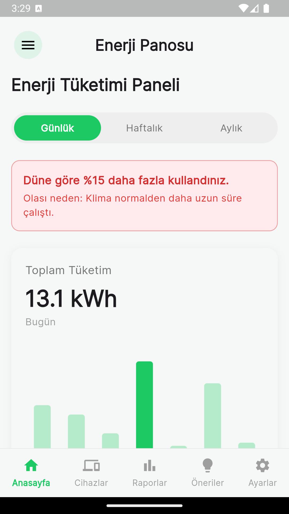

# 🏠 Smart Home Energy Optimization System

---

## 🚀 Project Overview

An end-to-end smart home energy optimization system combining:

- 📱 Mobile App (Flutter)
- 🧠 Machine Learning (Random Forest)
- ⚙️ Backend API (FastAPI)

Designed to analyze energy usage, predict future consumption, and provide intelligent recommendations for energy saving.

---

## 📊 Results & Impact

- Achieved **R² score of 0.96** in energy consumption prediction  
- Improved performance with effective **feature engineering**  
- Enabled intelligent recommendations based on real usage patterns  
- Demonstrates real-world impact of AI in energy optimization  

> This project showcases the integration of data analysis, machine learning, and user-centered application design.

---

## 👨‍💻 My Contribution

- Developed the **Flutter mobile application (multi-platform)**  
- Built and trained **Random Forest ML model**  
- Implemented backend using **FastAPI**  
- Performed **data preprocessing, EDA, and feature engineering**  
- Integrated ML model with mobile app via **REST API**  

---

## ✨ Key Capabilities

- 📱 Mobile Development: Flutter / Dart  
- 📊 Data Analysis: EDA, visualization, trend analysis  
- ⚙️ Backend Integration: REST API  
- 🧠 Machine Learning: Random Forest, prediction systems  
- 🔐 Security Awareness: Environment variables (.env), config management  

---

## 📸 Application Screens

| Dashboard | Reports | Suggestions |
|----------|--------|------------|
|  |  |  |

---

## ⏱️ 1-Minute Demo Flow

1. Login / Register  
2. View energy usage on Dashboard  
3. Trigger ML prediction  
4. Analyze reports  
5. Apply energy-saving recommendations  

---

## 🧠 Technologies Used

- Python, Pandas, NumPy  
- Scikit-learn (Random Forest)  
- Matplotlib  
- FastAPI  
- Flutter / Dart  

---

## 🔐 Security & Configuration

- Sensitive data (API keys, configs) managed via **.env**  
- No secrets are included in the repository  
- Backend is designed for **local development environment**  

> Follows basic security practices by separating configuration from source code.

---

## ⚙️ Setup (Local Development)

1. Clone the repository  
2. Create a `.env` file  
3. Install dependencies  
4. Run FastAPI backend  
5. Launch Flutter app  

---

## 👤 Author

**Emre Göktuğ Türk**  
🔗 GitHub: https://github.com/egtemre  
🔗 LinkedIn: https://www.linkedin.com/in/emre-g%C3%B6ktu%C4%9F-t%C3%BCrk-0a38a72b3/
